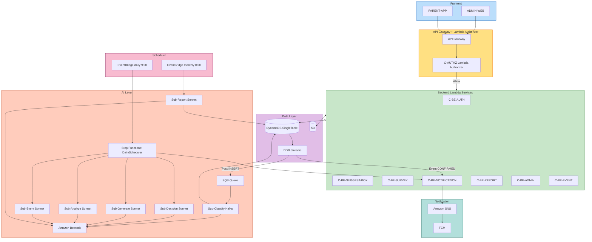

# サービス層設計 — 全自動PTA - おやのわ

**ドキュメント種別**: AI-DLC Application Design - Services 成果物
**作成日**: 2026-05-09

このドキュメントでは、複数コンポーネントを横断する **オーケストレーション** と **業務フロー** を定義します。
コンポーネント単体の動作は components.md / component-methods.md を参照。

---

## 1. サービス一覧

| サービス | トリガー | 所属コンポーネント | 関連要件 |
|---|---|---|---|
| **DailyScheduler Service** | EventBridge: 毎日9時 JST | C-AI-ORCH（Step Functions）+ 4 サブエージェント | F-02.1〜9, F-08.1, AI-ARCH |
| **MonthlyReport Service** | EventBridge: 月初0時 JST | C-AI-MONTHLY + C-AI-SUB-REPORT | F-04 |
| **PostClassification Service** | DynamoDB Streams: 投稿INSERT | C-STREAM-POST + SQS + C-AI-SUB-CLASSIFY | F-01.3 |
| **EventConfirmation Service** | DynamoDB Streams: イベント実施確定 | C-STREAM-EVENT-CONFIRM + C-BE-NOTIFICATION | F-10.1, F-03 |
| **EventCheckIn Service** | API Gateway: チェックインAPI | C-BE-EVENT + C-PKG-TYPES（QRトークン検証） | F-10.3〜5 |
| **NotificationDispatch Service** | API Gateway / 内部呼び出し | C-BE-NOTIFICATION + SNS | F-03 |
| **AdminOperationLog Service** | 全管理者破壊操作のラッパー | C-BE-ADMIN + DynamoDB | F-06.5 |
| **i18n Service** | フロントエンド初期化 | C-PKG-I18N | F-07 |

---

## 2. DailyScheduler Service（毎日9時 EventBridge トリガー）

### 役割
要件 F-02.1〜9 + F-08.1 を実装する **本プロジェクトの中核オーケストレーション**。
1日1回、各学校で自動的に「アンケート配信判断 → 配信 → 結果分析 → イベント企画」のチェーンを実行する。

### 構成（AWS Step Functions State Machine）

```
StateMachine: oyanowa-daily-scheduler-{env}

[Start: ForEachSchoolMap]
  ↓ (各学校に対して並列実行 maxConcurrency=10)
[State 1: SurveyDecision]
  Lambda: C-AI-SUB-DECISION
  Input: { schoolId, recentPosts (DynamoDB クエリ結果) }
  Output: { shouldDeliver, reason, mode }
  ↓ Choice
  ├─ shouldDeliver=true → [State 2]
  └─ shouldDeliver=false → [State 3]

[State 2: SurveyGeneration]
  Lambda: C-AI-SUB-GENERATE
  Input: { schoolId, recentPosts, pastTrends, seasonContext }
  Output: { surveyId, questions }
  Side Effect: DynamoDB に保存
  ↓
  [State 2-Notify: NotifySurveyDelivery]
    Lambda: C-BE-NOTIFICATION.sendSurveyDeliveryNotification
    Side Effect: SNS Publish → FCM → 全保護者プッシュ通知
  ↓
  [State 3]

[State 3: ScanExpiringSurveys]
  Lambda: 期日到来した未分析アンケートを取得
  Output: { surveysToAnalyze: [...] }
  ↓ Choice
  ├─ surveysToAnalyze.length > 0 → [State 4 Map]
  └─ 空 → [End]

[State 4: AnalyzeSurveysMap]
  並列実行（maxConcurrency=5）
  ├─ [SurveyResultAnalysis]
  │   Lambda: C-AI-SUB-ANALYZE
  │   Input: { schoolId, surveyId, aggregatedAnswers, recentPosts }
  │   Output: { nextAction, reason, urgencyScore }
  │   ↓ Choice
  │   ├─ nextAction=EVENT_PLAN → [EventPlanning]
  │   ├─ nextAction=URGENT_TOPIC → [NotifyAdminUrgent]
  │   └─ nextAction=NO_ACTION → [End]
  │
  ├─ [EventPlanning]
  │   Lambda: C-AI-SUB-EVENT
  │   Input: { schoolId, triggerSource: surveyId, analysisContext }
  │   Output: { eventProposal }
  │   Side Effect: DynamoDB に proposal 保存（status=VOTING）
  │
  └─ [NotifyAdminUrgent]
      Lambda: 管理者画面用の「緊急トピック検出」フラグ更新

[End: Success]
```

### エラー処理
- 各 Lambda Step に Retry 設定（指数バックオフ・最大3回）
- 全 Step に Catch 設定で失敗時 Slack 通知
- Step Functions Execution History で全実行追跡可能（NFR-MON-03 X-Ray 連携）

### 関連 SECURITY/PBT
- SECURITY-14: 各 Step の失敗が自動的に Slack 通知される設定
- SECURITY-03: 各 Step Lambda は構造化ログ出力、schoolId 必須
- PBT-03 不変条件: 各 Step の入出力スキーマは Zod で検証、不変条件テスト対象

---

## 3. MonthlyReport Service（月初トリガー）

### 役割
F-04: 毎月1日 0時 JST に AI が前月の月次レポートを各学校別に生成。

### 構成（シンプルな Lambda 連鎖、Step Functions 不使用）

```
[EventBridge: cron(0 15 1 * ? *) UTC = 月初 0時 JST]
  ↓
[C-AI-MONTHLY: monthly-report-trigger Lambda]
  ↓ (各学校に対して反復)
[C-AI-SUB-REPORT: generateMonthlyReport]
  Input: { schoolId, month, activityData, budgetData }
  Output: { contentMarkdown, metadata }
  Side Effect: DynamoDB に保存（status=PUBLISHED）
  ↓
[終了]
```

**注意**: MVP では月次レポート配信のプッシュ通知は行わない（明確化2-2 A）。アプリ内表示のみ。

---

## 4. PostClassification Service（投稿時 AI 分類）

### 役割
F-01.3: 投稿が新規作成されたら、AI（Haiku）で自動カテゴリ分類。

### 構成（A-4 非同期パターン）

```
[ユーザー投稿]
  ↓
[C-BE-SUGGEST-BOX.createPost]
  → DynamoDB INSERT（status=PENDING, category=null）
  → 即座に 201 レスポンス返却（ユーザーは待たない）

[DynamoDB Streams]
  ↓ INSERT イベント検出
[C-STREAM-POST: post-classification-trigger]
  → SQS Queue にメッセージ送信

[SQS]
  ↓ ポーリング
[C-AI-SUB-CLASSIFY: classify-post Lambda]
  → Bedrock Haiku 呼び出し
  → DynamoDB UPDATE（category, summary 設定）

[フロント]
  → 次回 GET /posts で更新済みデータ取得
  → カテゴリラベル表示
```

### エラー処理（SECURITY-15）
- Bedrock 失敗 → SQS DLQ 送信 + Slack 通知
- 3 回リトライ後 DLQ → 投稿は category="OTHER" で残す（fail-degraded）

---

## 5. EventConfirmation Service（実施確定通知）

### 役割
F-10.1 + F-03: 管理者がイベントを「実施確定」状態に遷移したら、全保護者に自動プッシュ通知。

### 構成

```
[管理者が「実施確定」ボタンタップ]
  ↓
[C-BE-EVENT.confirmEvent]
  → DynamoDB UPDATE（status: CANDIDATE → CONFIRMED）

[DynamoDB Streams]
  ↓ UPDATE イベント検出
[C-STREAM-EVENT-CONFIRM]
  → C-BE-NOTIFICATION.sendEventConfirmedNotification を呼び出し

[SNS Publish]
  → FCM → 全保護者にプッシュ通知（B-8 C: 賛成・反対・興味なし問わず全員）

[フロント]
  → 通知タップでイベント詳細画面に遷移
  → チェックイン受付期間中なら「チェックイン」ボタン表示
```

---

## 6. EventCheckIn Service

### 役割
F-10.3〜5: 当日のチェックイン受付。QR モードとタップモードの両方を管理者選択可能。

### 構成（B-7 X 反映）

```
[管理者: confirmEvent 時]
  → checkInMethod: "QR" | "TAP" を設定（デフォルト QR）
  → QR の場合: 一意の qrToken（時刻+署名）を発行、管理画面に表示

[当日の保護者]
  ↓ アプリで該当イベント開く
  ↓ チェックイン受付期間中なら「チェックイン」ボタン表示

[QR モード]
  → 「チェックイン」ボタンタップ → カメラ起動
  → 会場の QR を読み取り（qrToken 含む URL）
  → POST /events/:id/check-in { qrToken }

[タップモード]
  → 「チェックイン」ボタンタップ → 確認ダイアログ
  → POST /events/:id/check-in {}（qrToken 不要）

[C-BE-EVENT.checkInEvent]
  → 受付期間内チェック
  → 重複防止チェック（DynamoDB ConditionExpression）
  → QR モードの場合: qrToken 有効性検証（時刻署名・改竄チェック）
  → DynamoDB に CheckInEntry 保存
  → 200 レスポンス { checkedInAt }
```

### 管理者画面リアルタイム更新
```
[管理者: イベント詳細画面]
  → TanStack Query でポーリング（5秒間隔）
  → GET /events/:id/check-ins
  → 参加者数とリストをリアルタイム表示
```

---

## 7. NotificationDispatch Service

### 役割
F-03: プッシュ通知の配信を担う共通サービス。

### サブフロー

| シナリオ | トリガー | 配信対象 | サービス内のメソッド |
|---|---|---|---|
| AIアンケート配信 | DailyScheduler State 2-Notify | 全保護者 | `sendSurveyDeliveryNotification` |
| 管理者即時配信 | API: `POST /notifications/broadcast` | 全保護者 | `broadcastNotification` |
| イベント実施確定 | DynamoDB Streams（EventConfirmation Service） | 全保護者 | `sendEventConfirmedNotification` |

### 共通実装パターン
```
[何らかのトリガー]
  ↓
[NotificationDispatcher]
  → DynamoDB クエリで該当学校の保護者デバイストークン一覧取得
  → SNS Topic（学校別）に Publish
  → SNS が FCM 経由で各 Android デバイスに配信
  → 配信履歴を DynamoDB に記録（NFR-REL-03 リトライのため）
```

---

## 8. AdminOperationLog Service

### 役割
F-06.5 + NFR-COMP-02: 管理者の破壊的操作をすべて記録し、保護者公開可能にする。

### 構成（管理者操作の共通ラッパー）

```
[管理者が破壊的操作実行]
  ↓
[C-BE-ADMIN の各メソッド]
  → 操作前に「公開操作ログに残ります」確認ダイアログ（フロント側）
  → API 呼び出し
  → withOperationLog() ラッパー内で:
    ├─ 操作実行
    └─ DynamoDB OperationLog テーブルに記録
       { schoolId, adminUserId, operation, targetEntity, before, after, timestamp }

[保護者・管理者の閲覧]
  → GET /public-operation-log でアクセス可能
```

### 対象操作
- 投稿削除
- 保護者アカウント削除
- 投稿ステータス変更（特に RESOLVED）
- 学校コード無効化
- 月次レポート手動編集（Phase 2 想定、MVP では readonly）

---

## 9. i18n Service

### 役割
F-07: 日本語/英語のバイリンガル UI 提供。

### 構成（A-8 A: i18next）

```
[アプリ起動時]
  ↓
[C-PKG-I18N の initialize]
  → OS 言語または LocalStorage/AsyncStorage の保存値を読み取り
  → i18next を該当言語で初期化
  → JSON ファイル読み込み（ja/*.json, en/*.json）

[コンポーネントでの使用]
  → useTranslation() hook
  → t('common.button.submit') のようにキー参照

[言語切替]
  → ユーザーが設定画面で言語選択
  → i18next.changeLanguage()
  → LocalStorage/AsyncStorage に保存

[Coming Soon バッジ]
  → t('comingSoon.badge') が "Coming Soon" or "近日公開" を返す
```

### スコープ
- UIテキスト: 完全バイリンガル
- AI生成テキスト: 日本語のみ（明確化3 X 該当）
- 主対象ユーザー: 外国籍保護者（明確化3 補足 A）

---

## 10. オーケストレーション図（俯瞰）



### テキスト代替（Mermaid フォールバック）

```
Frontend (ADMIN-WEB / PARENT-APP)
  ↓ HTTPS
API Gateway → Lambda Authorizer (REQUEST型) → Backend Lambda Services
  ↓
Backend Lambda Services ← → DynamoDB (シングルテーブル) / S3
  ↓ Streams
- 投稿 INSERT → SQS → Post Classification (Haiku)
- イベント CONFIRMED → Notification → SNS → FCM

Daily Scheduler (EventBridge 9:00 JST):
  Step Functions: SurveyDecision → SurveyGeneration → Notification
                  ↓
                  ScanExpiringSurveys → Map(SurveyResultAnalysis → EventPlanning)

Monthly Report (EventBridge 月初 0:00 JST):
  Lambda → Monthly Report Sub-Agent → DynamoDB
```
