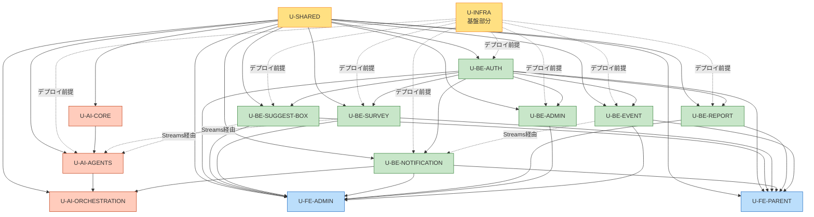

# ユニット依存マトリクス — 全自動PTA - おやのわ

**ドキュメント種別**: AI-DLC Units Generation - Dependency Matrix 成果物
**作成日**: 2026-05-09

---

## 1. ユニット依存マトリクス

凡例:
- 🟦 = ビルド時依存（型・ライブラリ import）
- 🟩 = ランタイム依存（API 呼び出し / イベント受信）
- 🟨 = デプロイ依存（このユニットの後にデプロイ必要）
- ⚪ = 依存なし

### 横軸（依存される側）× 縦軸（依存する側）

| ↓依存元 / →依存先 | U-SHARED | U-AI-CORE | U-INFRA | U-BE-AUTH | U-BE-SUGGEST-BOX | U-BE-SURVEY | U-BE-NOTIFICATION | U-BE-REPORT | U-BE-ADMIN | U-BE-EVENT | U-AI-AGENTS | U-AI-ORCHESTRATION | U-FE-ADMIN | U-FE-PARENT |
|---|---|---|---|---|---|---|---|---|---|---|---|---|---|---|
| **U-SHARED** | – | ⚪ | ⚪ | ⚪ | ⚪ | ⚪ | ⚪ | ⚪ | ⚪ | ⚪ | ⚪ | ⚪ | ⚪ | ⚪ |
| **U-AI-CORE** | 🟦 | – | ⚪ | ⚪ | ⚪ | ⚪ | ⚪ | ⚪ | ⚪ | ⚪ | ⚪ | ⚪ | ⚪ | ⚪ |
| **U-INFRA** | ⚪ | ⚪ | – | ⚪ | ⚪ | ⚪ | ⚪ | ⚪ | ⚪ | ⚪ | ⚪ | ⚪ | ⚪ | ⚪ |
| **U-BE-AUTH** | 🟦 | ⚪ | 🟨 | – | ⚪ | ⚪ | ⚪ | ⚪ | ⚪ | ⚪ | ⚪ | ⚪ | ⚪ | ⚪ |
| **U-BE-SUGGEST-BOX** | 🟦 | ⚪ | 🟨 | 🟩 | – | ⚪ | ⚪ | ⚪ | ⚪ | ⚪ | ⚪ | ⚪ | ⚪ | ⚪ |
| **U-BE-SURVEY** | 🟦 | ⚪ | 🟨 | 🟩 | ⚪ | – | ⚪ | ⚪ | ⚪ | ⚪ | ⚪ | ⚪ | ⚪ | ⚪ |
| **U-BE-NOTIFICATION** | 🟦 | ⚪ | 🟨 | 🟩 | ⚪ | ⚪ | – | ⚪ | ⚪ | ⚪ | ⚪ | ⚪ | ⚪ | ⚪ |
| **U-BE-REPORT** | 🟦 | ⚪ | 🟨 | 🟩 | ⚪ | ⚪ | ⚪ | – | ⚪ | ⚪ | ⚪ | ⚪ | ⚪ | ⚪ |
| **U-BE-ADMIN** | 🟦 | ⚪ | 🟨 | 🟩 | ⚪ | ⚪ | 🟩 | ⚪ | – | ⚪ | ⚪ | ⚪ | ⚪ | ⚪ |
| **U-BE-EVENT** | 🟦 | ⚪ | 🟨 | 🟩 | ⚪ | 🟩 | 🟩 | ⚪ | ⚪ | – | ⚪ | ⚪ | ⚪ | ⚪ |
| **U-AI-AGENTS** | 🟦 | 🟦 | 🟨 | ⚪ | ⚪ | ⚪ | ⚪ | ⚪ | ⚪ | ⚪ | – | ⚪ | ⚪ | ⚪ |
| **U-AI-ORCHESTRATION** | 🟦 | ⚪ | 🟨 | ⚪ | ⚪ | ⚪ | 🟩 | ⚪ | ⚪ | ⚪ | 🟨 | – | ⚪ | ⚪ |
| **U-FE-ADMIN** | 🟦 | ⚪ | 🟨 | 🟩 | 🟩 | 🟩 | 🟩 | 🟩 | 🟩 | 🟩 | ⚪ | ⚪ | – | ⚪ |
| **U-FE-PARENT** | 🟦 | ⚪ | 🟨 | 🟩 | 🟩 | 🟩 | 🟩 | 🟩 | ⚪ | 🟩 | ⚪ | ⚪ | ⚪ | – |

### 主要な観察

1. **U-SHARED は全ユニットからビルド時依存される**（最も基底）
2. **U-AI-CORE は U-AI-AGENTS のみが依存**（AI ライブラリは AI コンテキスト内に閉じる）
3. **U-INFRA は全ユニットからデプロイ時に必要**（AWS リソース定義の前提）
4. **U-BE-AUTH は他の全 Backend Service の前提**（Authorizer がランタイムで先に動作）
5. **Backend Service 同士の直接ランタイム依存は最小**（U-BE-EVENT → U-BE-NOTIFICATION のみ、それ以外は DynamoDB Streams 経由で疎結合）
6. **U-AI-ORCHESTRATION → U-BE-NOTIFICATION の依存**（Step Functions 内で通知 Lambda を起動）

---

## 2. 依存階層（DAG）

```
Level 0 (基盤、依存ゼロ): U-SHARED / U-INFRA (基盤部分のみ)
                                ↓
Level 1: U-AI-CORE (U-SHARED に依存)
                                ↓
Level 2: U-BE-AUTH (U-SHARED + U-INFRA AuthStack)
                                ↓
Level 3: 他の Backend Service Lambda 群 (U-BE-AUTH を Authorizer として前提)
         並列開発可能: U-BE-SUGGEST-BOX, U-BE-SURVEY, U-BE-NOTIFICATION,
                       U-BE-REPORT, U-BE-ADMIN, U-BE-EVENT
                                ↓
Level 4: U-AI-AGENTS (U-AI-CORE に依存、U-BE-* と並列でも可能だが
                      Agents 出力を保存する DynamoDB は Backend と共有)
                                ↓
Level 5: U-AI-ORCHESTRATION (U-AI-AGENTS の Lambda ARN を参照)
                                ↓
Level 6: U-FE-ADMIN, U-FE-PARENT (Backend API + 共有パッケージに依存)
                                ↓
Level 7: U-INFRA (フロントエンド配信スタック・モバイルビルドスタック)
```

### Mermaid 依存グラフ



### テキスト代替（Mermaid フォールバック）

```
Level 0: U-SHARED, U-INFRA (基盤部分)
Level 1: U-AI-CORE
Level 2: U-BE-AUTH
Level 3: U-BE-SUGGEST-BOX, U-BE-SURVEY, U-BE-NOTIFICATION,
         U-BE-REPORT, U-BE-ADMIN, U-BE-EVENT (並列可能)
Level 4: U-AI-AGENTS
Level 5: U-AI-ORCHESTRATION
Level 6: U-FE-ADMIN, U-FE-PARENT (並列可能)
Level 7: U-INFRA (フロントエンド配信・モバイルビルド)

ストリーム経由の疎結合:
  U-BE-SUGGEST-BOX --(Streams)--> U-AI-AGENTS (sub-classify)
  U-BE-SURVEY --(Streams)--> U-AI-AGENTS (sub-analyze)
  U-BE-EVENT --(Streams)--> U-BE-NOTIFICATION
```

---

## 3. 開発順序（推奨実行プラン）

### Phase 1: 基盤層（Critical Path 開始点）

| 順序 | ユニット | 推定工数（AI主導）| ブロッキング理由 |
|---|---|---|---|
| 1 | U-SHARED | 2〜3日 | 全ユニットの型定義・Zod スキーマがここに集約される |
| 2 | U-AI-CORE | 2〜3日 | プロンプト管理・Bedrock ラッパー・Guardrails |
| 3 | U-INFRA（基盤部分: NetworkStack, SecretsStack, DataStack, AuthStack）| 3〜4日 | AWS リソースの土台 |

**並列実行可能**: U-SHARED と U-AI-CORE は U-AI-CORE が U-SHARED に依存するので順序必要。U-INFRA 基盤部分は U-SHARED と並列可能。

### Phase 2: 認証層（最小ブロッキング）

| 順序 | ユニット | 推定工数 | ブロッキング理由 |
|---|---|---|---|
| 4 | U-BE-AUTH | 3〜4日 | 全 Backend Service の Authorizer + Cognito 連携 |

### Phase 3: バックエンドサービス層（並列可能）

| 順序 | ユニット | 推定工数 | 並列可否 |
|---|---|---|---|
| 5a | U-BE-SUGGEST-BOX | 3〜4日 | 並列可 |
| 5b | U-BE-SURVEY | 3〜4日 | 並列可 |
| 5c | U-BE-NOTIFICATION | 2〜3日 | 並列可 |
| 5d | U-BE-REPORT | 2日 | 並列可 |
| 5e | U-BE-ADMIN | 3〜4日 | 並列可 |
| 5f | U-BE-EVENT | 4〜5日（最大規模、F-08+F-10）| U-BE-NOTIFICATION 完了が望ましい |

**AI主導開発のメリット**: 並列実行で Phase 3 全体が 4〜5日で完了可能（人間レビューがボトルネック）。

### Phase 4: AI 層

| 順序 | ユニット | 推定工数 | ブロッキング理由 |
|---|---|---|---|
| 6 | U-AI-AGENTS | 5〜7日（6サブエージェント分）| U-AI-CORE と Backend Service の DynamoDB スキーマ確定後 |
| 7 | U-AI-ORCHESTRATION | 2〜3日 | U-AI-AGENTS の Lambda ARN を参照 |

### Phase 5: フロントエンド層（並列可能）

| 順序 | ユニット | 推定工数 | 並列可否 |
|---|---|---|---|
| 8a | U-FE-ADMIN | 5〜7日 | 並列可 |
| 8b | U-FE-PARENT | 7〜10日（管理者画面より広範）| 並列可 |

### Phase 6: インフラ完成

| 順序 | ユニット | 推定工数 | ブロッキング理由 |
|---|---|---|---|
| 9 | U-INFRA（FrontendStack, MobileBuildStack）| 1〜2日 | フロントエンドの配信先 |

### 全体推定タイムライン

| フェーズ | 期間（人間レビュー込み）|
|---|---|
| Phase 1 (基盤) | 5〜7日 |
| Phase 2 (認証) | 3〜4日 |
| Phase 3 (バックエンド、並列) | 5〜7日 |
| Phase 4 (AI) | 7〜10日 |
| Phase 5 (フロントエンド、並列) | 7〜10日 |
| Phase 6 (インフラ完成) | 1〜2日 |
| **合計** | **約 28〜40 営業日** |

これは Workflow Planning 段階の概算（45〜80営業日）より短い。AI主導開発（A-6 D）の効率化効果。

---

## 4. Critical Path 分析

```
[Critical Path]
U-SHARED → U-BE-AUTH → U-BE-EVENT → U-FE-PARENT → 完了

並列実行可能なオフCritical Path:
- U-AI-CORE → U-AI-AGENTS → U-AI-ORCHESTRATION（AI チェーン）
- 他の U-BE-* ユニット
- U-FE-ADMIN
- U-INFRA の各スタック
```

### Critical Path のリスクと緩和策

| リスク | 影響 | 緩和策 |
|---|---|---|
| U-SHARED の型定義変更 | 全ユニットへの影響 | Phase 1 で型を確定 → 以後変更最小化 |
| U-BE-AUTH の Authorizer 不具合 | 全 Backend Service 動作不能 | E2E テストで認可シナリオ網羅 |
| U-BE-EVENT が最大規模で遅延 | Phase 5 ブロック | Sub-agent と並行で先行着手 |
| U-FE-PARENT の Expo / EAS Build 互換性問題 | F-11 .apk 生成失敗 | OQ-17 を Application Design で確定済 + Phase 2 序盤で PoC |

---

## 5. ストリーム依存（疎結合）

DynamoDB Streams 経由の非同期依存は **ランタイム依存**ですが、ビルド・デプロイ時には独立しています。

| ストリーム源 | 受信ユニット | イベント |
|---|---|---|
| U-BE-SUGGEST-BOX (Posts INSERT) | U-AI-AGENTS (sub-classify) | 投稿分類 |
| U-BE-SURVEY (Survey CLOSED) | U-AI-AGENTS (sub-analyze) → U-AI-AGENTS (sub-event)| 結果分析・企画 |
| U-BE-EVENT (Event CONFIRMED) | U-BE-NOTIFICATION | 通知配信 |

**ビルド時依存ではない**ので、これらのユニットは型定義（U-SHARED）さえ整えば独立して開発可能。

---

## 6. ユニット間 API 契約

ランタイム依存のうち、API 契約として明示的に管理するもの:

| 依存元 | 依存先 | 契約内容 |
|---|---|---|
| 全 Backend Service | U-BE-AUTH | Lambda Authorizer の context フォーマット (`schoolId`, `userId`, `userType`) |
| U-FE-* | 全 Backend Service | OpenAPI 仕様 (`docs/api/openapi.yaml`)、Zod スキーマ（U-SHARED 経由） |
| U-AI-AGENTS | U-AI-CORE | `BedrockClient` インターフェース |
| U-AI-ORCHESTRATION | U-AI-AGENTS | Step Functions ステップへの Lambda ARN 受け渡し（Stack Outputs 経由）|
| U-AI-ORCHESTRATION | U-BE-NOTIFICATION | Step Functions から Notification Lambda の invoke |
| ストリーム経由（疎結合）| 各ユニット | DynamoDB Item の構造（U-SHARED の型で定義）|

---

## 7. ユニット境界違反の防止

開発中に守るべき原則:

1. **直接 Lambda 呼び出し禁止**: Backend Service Lambda 同士の `lambda:InvokeFunction` は原則禁止（Step Functions / SQS / Streams 経由）
2. **DynamoDB アクセスの責任分離**: 各ユニットは自分の管理エンティティのみ読み書き（schoolId フィルタは認可で強制）
3. **shared types 経由の通信**: ユニット間で型を直接 import せず、必ず `packages/shared-types` 経由
4. **AI ライブラリの集中管理**: Bedrock 呼び出しは必ず `packages/ai-core/bedrock-client` を経由（直接 SDK 利用禁止）

---

## 7.6. U-LOCAL の依存関係（追加要望6）

U-LOCAL は他のユニットに依存するが、他のユニットは U-LOCAL に依存しない（一方向）。

| U-LOCAL の依存先 | 依存内容 |
|---|---|
| U-SHARED | 型定義 (Zod スキーマ) を参照 |
| U-AI-CORE | MockBedrockClient を利用、Factory Pattern を呼ぶだけ |
| U-BE-* (全 Backend Service) | Express ルータをそのままマウント |
| U-INFRA | AWS リソース定義は参照のみ（CDK 実行はしない） |

| U-LOCAL のデプロイ依存 | なし（開発者マシン上で動作）|
| U-LOCAL の Critical Path 影響 | **オフ Critical Path**（並列開発可能）|
| 並列開発推奨タイミング | Phase 1 と並行して着手 → Phase 2 開始時には完成させると後続開発が高速化 |

### 開発フロー上の利点

```
Phase 1 完了時点で U-LOCAL が動作可能
  ↓
Phase 2 (U-BE-AUTH) 開発時:
  → ローカルで cognito-local + Express middleware を組み合わせて E2E 動作確認
  → AWS デプロイ前にバグ発見可能、コスト・時間節約

Phase 3 (Backend Service) 開発時:
  → Service ごとにローカルで API 動作確認
  → DynamoDB Local で実 DynamoDB 互換のクエリ動作確認

Phase 4 (AI) 開発時:
  → MockBedrockClient で UI/フロー確認
  → Real Bedrock 接続は最後に AWS dev 環境で実施
```

---

## 8. デプロイ依存関係

### CDK スタックのデプロイ順序

```
1. SecretsStack         (KMS Key)
2. NetworkStack         (将来用、MVP では空)
3. AuthStack            (Cognito User Pools)
4. DataStack            (DynamoDB + S3)
5. ApiStack             (API Gateway + Lambda Authorizer)
   ↓ 並列可能
6a. AiStack             (SQS + Sub-Agents + Step Functions)
6b. NotificationStack   (SNS + EventBridge)
7. MonitoringStack      (CloudWatch + Slack Webhook)
8. FrontendStack        (CloudFront + S3 admin)
9. MobileBuildStack     (EAS Build IAM)
```

`cdk deploy --all` で順序自動解決される（CloudFormation 依存）。
