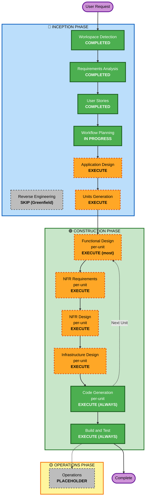

# 実行計画書 — 全自動PTA - おやのわ

**ドキュメント種別**: AI-DLC Workflow Planning 成果物
**作成日**: 2026-05-09
**プロジェクト種別**: Greenfield SaaS 新規開発

---

## 1. 詳細分析サマリー

### 1.1 変更影響評価（Change Impact Assessment）

| 影響領域 | 該当 | 詳細 |
|---|---|---|
| **User-facing changes** | ✅ Yes | 31 user stories で覆う 5 ペルソナ向けの新機能群 |
| **Structural changes** | ✅ Yes | 全く新規のシステム構築（モノレポ + Lambda群 + CDK インフラ + マルチテナント設計） |
| **Data model changes** | ✅ Yes | DynamoDB シングルテーブルデザイン（PK/SK/GSI 設計）+ S3 プレフィックス分離 + Cognito ユーザー属性 |
| **API changes** | ✅ Yes | 全ての REST API エンドポイントが新規（Cognito JWT 認可 + Zod バリデーション） |
| **NFR impact** | ✅ Yes | Security Baseline 全15ルール強制 + PBT Partial 適用 + パフォーマンス目標明示 + マルチテナント分離 |

#### Application Layer Impact
- **新規コード**: バックエンド Lambda 群（投稿・アンケート・レポート・AI連携・チェックイン等）/ Web 管理者画面（Next.js 16）/ React Native 保護者アプリ
- **新規依存関係**: shadcn/ui / Radix / Tailwind / Zustand / TanStack Query / Express / Zod / @aws-sdk/* / @anthropic-ai/sdk / fast-check
- **新規構成ファイル**: `pnpm-workspace.yaml`, `turbo.json`, 各 app/package の `package.json` など
- **新規テスト**: 単体テスト（Jest）/ コンポーネントテスト（RTL）/ E2E（Playwright）/ APIテスト（Supertest）/ インフラテスト（CDK Assertions）/ PBT（fast-check）

#### Infrastructure Layer Impact
- **新規 CDK スタック**: 計算系（Lambda + API Gateway）/ データ系（DynamoDB + S3）/ 認証系（Cognito）/ 通知系（SNS + SES + EventBridge）/ AI系（Bedrock / SQS）/ 配信系（CloudFront + WAF）/ 監視系（CloudWatch + X-Ray）/ シークレット系（Secrets Manager + KMS）
- **デプロイ**: dev 環境のみ（質問9 C）、本番化は Phase 2 着手時
- **CI/CD**: GitHub Actions（Lint・Unitテスト）+ AWS CodeBuild（ビルド・E2E・cdk synth）+ AWS CodePipeline + CodeDeploy（デプロイ）

#### Operations Layer Impact
- **モニタリング**: CloudWatch Dashboard・X-Ray トレース・Slack 通知（NFR-MON-02）
- **ロギング**: 構造化 JSON ログ + schoolId 必須 + PII 出力禁止
- **アラート**: SECURITY-14 準拠（認証失敗・認可違反等で Slack 通知）

### 1.2 リスク評価

| 評価項目 | レベル | 根拠 |
|---|---|---|
| **Risk Level** | **High** | 個人情報を扱うマルチテナント SaaS / 学校・自治体導入予定 / ISMS 取得目標 / AI による自動アクション多数 |
| **Rollback Complexity** | Moderate | dev 環境のみで MVP 立ち上げのため初期段階のロールバックは容易、ただし Phase 2 で本番化以降は要再評価 |
| **Testing Complexity** | Complex | E2E + AI プロンプトテスト（ゴールデンテスト） + セキュリティテスト + マルチテナントの IDOR テスト + PBT |

### 1.3 開発スコープ概要

| 項目 | 値 |
|---|---|
| ペルソナ数 | 5 |
| ユーザーストーリー数 | 32 |
| 機能要件数（IDベース） | F-01 〜 F-11 + AI-ARCH + AI-PROMPT |
| **MVPプラットフォーム** | **Android のみ（.apk 配布）**。Web版 Phase 2 / iOS Phase 3 |
| AIサブエージェント数 | 6（Post Classification / Survey Decision / Survey Generation / Survey Result Analysis / Event Planning / Monthly Report） |
| Security ルール強制数 | 15 |
| PBT ルール強制数 | 5（PBT-02, 03, 07, 08, 09） |
| アプリケーション数 | 2（Web 管理者画面 + RN 保護者アプリ） |
| バックエンドモジュール数 | 概算 8〜12（機能エリア別 Lambda 群） |

---

## 2. ワークフロー可視化



### テキスト代替（Mermaid フォールバック）

```
INCEPTION PHASE:
- Workspace Detection: COMPLETED
- Reverse Engineering: SKIP (Greenfield)
- Requirements Analysis: COMPLETED
- User Stories: COMPLETED (5 personas / 31 stories)
- Workflow Planning: IN PROGRESS（このドキュメント）
- Application Design: EXECUTE
- Units Generation: EXECUTE

CONSTRUCTION PHASE (per-unit loop):
- Functional Design: EXECUTE (大半のユニット、簡単な共有ライブラリのみSKIP)
- NFR Requirements: EXECUTE
- NFR Design: EXECUTE
- Infrastructure Design: EXECUTE
- Code Generation: EXECUTE (ALWAYS)
- Build and Test: EXECUTE (ALWAYS)

OPERATIONS PHASE:
- Operations: PLACEHOLDER (将来の拡張)
```

---

## 3. 実行フェーズ判定

### 🔵 INCEPTION PHASE

| ステージ | 判定 | 根拠 |
|---|---|---|
| Workspace Detection | ✅ **COMPLETED** | Greenfield 確定済み |
| Reverse Engineering | ⏭️ **SKIP** | Greenfield のため不要 |
| Requirements Analysis | ✅ **COMPLETED** | Comprehensive Depth で完了・承認済み |
| User Stories | ✅ **COMPLETED** | 5 ペルソナ + 31 ストーリー 完了・承認済み |
| Workflow Planning | 🔄 **IN PROGRESS** | このドキュメント |
| **Application Design** | ▶️ **EXECUTE** | **根拠**: 新規コンポーネント多数（Lambda群・AIエージェント6体・Web/RN フロントエンド・CDKスタック多数）、サービス層設計必須、コンポーネント間依存の明確化が必須 |
| **Units Generation** | ▶️ **EXECUTE** | **根拠**: モノレポに複数アプリ（apps/web-admin, apps/app-parent）+ 複数バックエンドモジュール + 共有パッケージ + インフラスタック多数、明示的な分解が並列開発と Code Generation の効率化に必須 |

### 🟢 CONSTRUCTION PHASE

| ステージ | 判定 | 根拠 |
|---|---|---|
| **Functional Design** (per-unit) | ▶️ **EXECUTE**（大半のユニット） | **根拠**: AI ロジック・賛否投票判定・配信判断・チェックイン重複防止・マルチテナント分離など複雑なビジネスロジック多数。共有ライブラリ系のシンプルなユニットは SKIP の可能性あり |
| **NFR Requirements** (per-unit) | ▶️ **EXECUTE** | **根拠**: SECURITY 全15ルール強制・PBT Partial 適用・パフォーマンス目標明示・マルチテナント要件あり、tech stack 確認も必要 |
| **NFR Design** (per-unit) | ▶️ **EXECUTE** | **根拠**: NFR Requirements 実行のため、各ユニットで NFR パターン（IAM最小権限・暗号化・X-Ray連携・WAF・rate limit 等）の組み込み設計が必須 |
| **Infrastructure Design** (per-unit) | ▶️ **EXECUTE** | **根拠**: AWS CDK でのインフラ定義必須、Lambda・DynamoDB・SNS・EventBridge・Cognito などのリソース設計が各ユニットで必要 |
| Code Generation | ✅ **EXECUTE (ALWAYS)** | 必須ステージ |
| Build and Test | ✅ **EXECUTE (ALWAYS)** | 必須ステージ |

### 🟡 OPERATIONS PHASE

| ステージ | 判定 | 根拠 |
|---|---|---|
| Operations | ⏸️ **PLACEHOLDER** | 将来の拡張ステージ |

---

## 4. 想定 Units（Application Design 段階で確定）

Application Design で確定する想定の主要ユニット候補（参考）:

### フロントエンド系（2 units）
| Unit | 内容 |
|---|---|
| **U-FE-ADMIN** | apps/web-admin（Next.js 16 管理者画面） |
| **U-FE-PARENT** | apps/app-parent（React Native + Expo / EAS Build, **Android .apk 配布のみ**, iOS ビルドは Phase 3） |

### バックエンド系（8 units 想定）
| Unit | 機能要件 |
|---|---|
| **U-BE-AUTH** | F-05 認証（Cognito 連携・学校コード管理） |
| **U-BE-SUGGEST-BOX** | F-01 目安箱（投稿・閲覧・支持・ステータス管理） |
| **U-BE-SURVEY** | F-02 アンケート（配信・回答・集計） |
| **U-BE-NOTIFICATION** | F-03 通知（SNS / SES / EventBridge スケジューラ） |
| **U-BE-REPORT** | F-04 月次レポート |
| **U-BE-EVENT** | F-08 イベント企画 + F-10 チェックイン |
| **U-BE-ADMIN** | F-06 管理者操作（学校コード発行・保護者管理・公開操作ログ） |
| **U-BE-AI** | AI Orchestrator + 6サブエージェント（共有ライブラリとして） |

### 共有・基盤系（3 units 想定）
| Unit | 内容 |
|---|---|
| **U-SHARED-TYPES** | packages/shared（型定義・ユーティリティ・Zod スキーマ）|
| **U-SHARED-UI** | packages/ui（共通 shadcn ベース UI コンポーネント）|
| **U-SHARED-API-CLIENT** | packages/api-client（フロントエンド共通 API クライアント）|

### インフラ系（複数 CDK スタック、1 unit にまとめるか分割するかは要検討）
| Unit | 内容 |
|---|---|
| **U-INFRA** | infra/cdk（CDK スタック群: 計算・データ・認証・通知・配信・監視・シークレット） |

**想定 Units 数**: **14 units 程度**（Application Design 段階で最終確定）

---

## 5. 推定タイムライン（参考、目安）

> 注: AI-DLC は反復的なステージ進行のため、人間-AI 協調ワークでの目安を示す。実際の実装着手フェーズは規模依存。

| 段階 | 想定期間（人間レビュー込み） |
|---|---|
| **INCEPTION 残り**（Application Design + Units Generation）| 2〜4営業日 |
| **CONSTRUCTION**（per-unit × 14ユニット） | 30〜60営業日（並列化可能だが依存ありで完全並列は困難） |
| **Build and Test** | 5〜10営業日 |
| **合計**（dev 環境動作確認まで） | おおよそ **45〜80営業日** |

---

## 6. 成功基準

### Primary Goal
**MVP（F-01〜F-10）が dev 環境で動作し、ユーザーストーリー31本のすべての受け入れ基準が検証可能な状態になる**

### Key Deliverables
- [ ] モノレポ構造（pnpm workspaces + Turborepo）構築済み
- [ ] 管理者向け Web アプリ（Next.js 16 + shadcn/ui）動作
- [ ] 保護者向けモバイルアプリ（React Native）動作
- [ ] バックエンド Lambda 群が API Gateway 経由で公開
- [ ] AI オーケストレーター + 6 サブエージェント実装
- [ ] DynamoDB シングルテーブル設計の実装
- [ ] Cognito 認証（保護者プール + 管理者プール with MFA）
- [ ] EventBridge 毎日9時トリガー + 月初トリガー
- [ ] CDK で AWS リソース全構築（dev 環境）
- [ ] CI/CD パイプライン（GitHub Actions + CodeBuild + CodePipeline）動作
- [ ] **Android 保護者アプリの .apk が CodeBuild で自動ビルドされる**（F-11）
- [ ] **Google Play 配信用メタデータ（アプリ名・説明・スクリーンショット・プライバシーポリシーURL）が揃っている**（F-11.5）
- [ ] iOS ビルド未実施（Phase 3 で対応予定、コードベースは MVP で構築済み）
- [ ] CloudWatch Dashboard + X-Ray + Slack 通知
- [ ] 日英 i18n
- [ ] F-09 Coming Soon UI で5項目表示
- [ ] F-10 参加者チェックイン動作

### Quality Gates（要件 §13 の受け入れ基準と同期）
- [ ] 全 SECURITY 15ルールの検証項目が満たされる、または N/A 理由が文書化
- [ ] PBT 適用ルール（02/03/07/08/09）の検証項目が満たされる
- [ ] AIエージェント分離（オーケストレーター + 6サブエージェント）が実装される
- [ ] 毎日9時 EventBridge トリガーで「配信判断 → アンケート配信 → 結果分析 → イベント企画」のチェーンが動作
- [ ] イベント企画案（F-08）の生成 → 賛否投票 → 実施候補 → 実施確定 → チェックイン（F-10）→ 参加状況確認 のフローが動作
- [ ] プロンプトのゴールデンテストが CI で実行される
- [ ] CloudWatch Dashboard で主要メトリクスが可視化
- [ ] Slack アラートが少なくとも1件のテストイベントで発火
- [ ] CI/CD パイプラインが動作

---

## 7. リスクと緩和策

| リスク | 影響度 | 緩和策 |
|---|---|---|
| AIエージェント設計の複雑さによる開発遅延 | 高 | Application Design 段階で AI-ARCH を最優先で設計、Bedrock Guardrails 早期 PoC |
| マルチテナント設計の不備による IDOR 脆弱性 | 高 | SECURITY-08 強制適用、E2E で IDOR テスト必須化、CDK Construct での共通化 |
| dev 環境のみのため本番運用想定の検証不十分 | 中 | 「将来の本番化を見越した設計」を Application Design 段階で明示・OQ-01 を Phase 2 着手時に解決 |
| プロンプト品質低下による AI 出力品質劣化 | 中 | AI-PROMPT-01〜04 強制（ディレクトリ管理 + ゴールデンテスト + Guardrails + PR レビュー） |
| Bedrock 呼び出しコスト増大 | 中 | Sonnet/Haiku 使い分け（質問14 A）、SQS キューイング、X-Ray でレイテンシ可視化 |
| 32本のユーザーストーリーすべて MVP 範囲だが工数オーバー | 中 | MoSCoW 優先度（Must 21 / Should 8 / Could 1 程度）に従い、Could から削減可能な構造 |
| **iPhone 保護者が MVP に参加できない** | 中 | Phase 2 の Web 版で iPhone・PC ユーザーがアクセス可能になる旨を運用ガイドラインに明記、Phase 3 で iOS リリース完了 |
| **Expo + EAS Build と Bedrock SDK / Lambda 構成の互換性確認漏れ** | 低 | OQ-17 として Application Design 段階で互換性確認、bare RN へのフォールバックパスも検討 |
| **Google Play 開発者アカウント取得の遅延** | 中 | OQ-18 として MVP リリース前に運用責任者と申請タイミングを確定 |

---

## 8. オープン課題の解決マッピング

| OQ ID | 課題 | 解決ステージ |
|---|---|---|
| OQ-01 | 本番環境（staging/prod）構築タイミング | Phase 2 着手時 |
| OQ-02 | Slack チャンネル名・Webhook URL | Code Generation 前まで |
| OQ-03 | 退会期間・データエクスポート期間 | プライバシーポリシー策定時（並行） |
| OQ-04 | サポート体制 | Phase 1 リリース前 |
| OQ-05 | Bedrock Guardrails の具体的設定 | Application Design |
| OQ-06 | プロンプトのゴールデンテストコーパス | Code Generation |
| OQ-07 | 学校コードの長さ・文字種・有効期限デフォルト | Application Design |
| OQ-08 | i18n 英語訳のレビュー体制 | Code Generation |
| OQ-09 | アンケート配信判断のしきい値 | Application Design |
| OQ-10 | 退会時の物理/論理削除 | Application Design |
| OQ-11 | F-09 Coming Soon 対象機能の最終リスト | Application Design |
| OQ-12 | F-08「賛成多数」しきい値ロジック | Application Design |
| OQ-13 | F-02.7「次アクション判定」基準 | Application Design |
| OQ-14 | F-08 検証期間・成功指標 | MVP リリース後 |
| OQ-15 | F-10 チェックイン方式（QR / タップ / 両方） | Application Design |
| OQ-16 | F-10「実施確定」遷移後の通知 | Application Design |

→ Application Design 段階で **9件** を解決予定。

---

## 9. 次ステージ

承認後の次ステージ: **Application Design**

Application Design では以下を行います:
- コンポーネント識別とサービスレイヤー設計
- AIエージェントアーキテクチャの確定
- DynamoDB シングルテーブルデザイン
- API エンドポイント一覧
- 主要なシーケンス図（毎日9時トリガーチェーン、イベント企画→チェックインなど）
- OQ-05, 07, 09〜13, 15, 16 の確定
